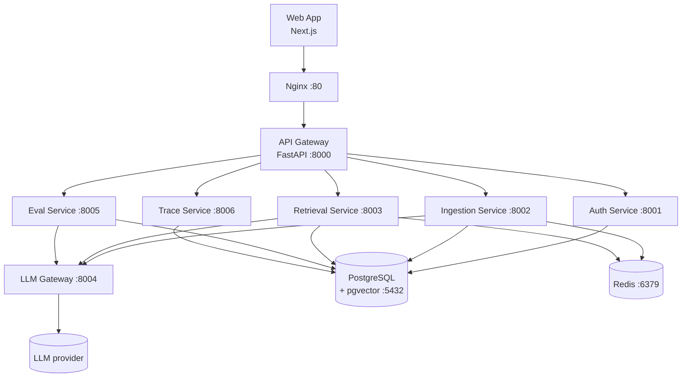

# KnowledgeOps

[]() []() []() []() []()

**8-service microservices platform for AI knowledge operations.**

Complete stack with document ingestion, hybrid retrieval, LLM gateway, evaluation, and observability — all orchestrated with Docker Compose.

[Quick Demo](#quick-demo) • [Architecture](#architecture) • [Services](#services)

---

## Quick Demo

```bash
make demo
```

Starts all 8 services, runs health checks, and opens the platform at http://localhost:3000

---

## Table of Contents

1. [Overview](#overview)
2. [Architecture](#architecture)
3. [Services](#services)
4. [Tech Stack](#tech-stack)
5. [Prerequisites](#prerequisites)
6. [Quick Start](#quick-start)
7. [Project Structure](#project-structure)
8. [Configuration](#configuration)
9. [Development](#development)
10. [Testing](#testing)
11. [Deployment](#deployment)
12. [License](#license)

---

## Overview

KnowledgeOps is a complete, production-ready platform for building internal AI knowledge tools. It combines document ingestion, hybrid retrieval with citations, LLM gateway with cost controls, automated evaluation, and full observability into a single deployable stack.

### Why This Exists

Most AI platform demos show a simple chatbot. Production systems need ingestion pipelines, retrieval quality controls, cost governance, evaluation harnesses, and observability. This project is the "final boss" portfolio piece that demonstrates all of these concerns working together.

### Key Capabilities

- **Multi-format ingestion** — PDF, Markdown, HTML, DOCX with chunking, deduplication, and versioning
- **Hybrid retrieval** — Vector + keyword search with reranking and citation assembly
- **LLM gateway** — Provider routing, caching, budget enforcement, and request logging
- **Automated evals** — Semantic match, citation verification, and refusal detection judges
- **Full tracing** — Request-level traces with storage and replay capabilities
- **Admin controls** — User management, RBAC, cost dashboards, and system configuration

---

## Architecture



All services communicate through the API Gateway, which centralizes authentication, RBAC,
routing, and health aggregation. The LLM Gateway proxies all LLM provider calls with
middleware for caching, budget enforcement, and logging. Every service degrades gracefully
to an in-memory fallback when PostgreSQL or Redis is unavailable (see
[docs/failure-modes.md](docs/failure-modes.md)), and the web console renders a static demo
dataset behind a visible banner when the backend is unreachable.

A deeper component view, request sequence diagrams, and the verification gate live in
[docs/architecture.md](docs/architecture.md) and [docs/EXECUTION_PLAN.md](docs/EXECUTION_PLAN.md).

---

## Services

| Service | Port | Language | Description |
|---------|------|----------|-------------|
| Web App | 3000 | TypeScript/Next.js | Frontend UI with chat, documents, evals, traces, costs, admin |
| API Gateway | 8000 | Python/FastAPI | Request routing, aggregation, health checks |
| Auth Service | 8001 | Python/FastAPI | API key management, sessions, RBAC |
| Ingestion Service | 8002 | Python/FastAPI | Document parsing, chunking, dedup, versioning |
| Retrieval Service | 8003 | Python/FastAPI | Hybrid search, reranking, citation assembly |
| LLM Gateway | 8004 | TypeScript/Express | Provider proxy, routing, caching, budget |
| Eval Service | 8005 | Python/FastAPI | RAG eval runner, judges, reporting |
| Trace Service | 8006 | Python/FastAPI | Trace collection, storage, replay |
| PostgreSQL | 5432 | — | Primary database with pgvector |
| Redis | 6379 | — | Queue and cache |
| Nginx | 80 | — | Reverse proxy for development |

---

## Tech Stack

| Layer | Technology |
|-------|-----------|
| AI Services | Python 3.11+, FastAPI, Pydantic v2 |
| LLM Gateway | TypeScript, Node.js, Express |
| Frontend | Next.js 14+, TypeScript, Tailwind CSS |
| Database | PostgreSQL 16 with pgvector |
| Queue | Redis |
| Orchestration | Docker Compose |

---

## Prerequisites

- Docker & Docker Compose v2+
- Node.js 20+ (for local frontend development)
- Python 3.11+ (for local service development)
- An OpenAI API key (or compatible provider)

---

## Quick Start

```bash
# Clone the repository
git clone <repo-url> knowledgeops
cd knowledgeops

# Copy environment variables
cp .env.example .env

# Edit .env with your API keys
# At minimum, set OPENAI_API_KEY

# Start all services
docker compose up --build

# Access the platform
# Frontend:  http://localhost
# API Docs:  http://localhost/api/docs
```

See [docs/QUICKSTART.md](docs/QUICKSTART.md) for the detailed walkthrough.
See [docs/API.md](docs/API.md) for gateway routes, auth behavior, response envelopes, and local demo-token usage.

---

## Project Structure

```
knowledgeops/
├── services/          # Individual microservices
│   ├── web-app/       # Next.js frontend
│   ├── api-gateway/   # FastAPI gateway
│   ├── auth-service/  # Authentication & RBAC
│   ├── ingestion-service/  # Document processing
│   ├── retrieval-service/  # Search & RAG
│   ├── llm-gateway/   # LLM provider proxy
│   ├── eval-service/  # Evaluation harness
│   └── trace-service/ # Observability
├── shared/            # Shared libraries
│   ├── python/        # Common Python utilities
│   └── ts/            # Common TypeScript types
├── infra/             # Infrastructure config
│   ├── postgres/      # DB initialization
│   └── nginx/         # Reverse proxy
├── data/              # Sample data & eval suites
├── tests/             # Integration tests
└── docs/              # Documentation
```

---

## Configuration

All configuration is managed through environment variables. Copy `.env.example` to `.env` and customize:

| Variable | Description | Default |
|----------|-------------|---------|
| `OPENAI_API_KEY` | OpenAI API key | — |
| `DATABASE_URL` | PostgreSQL connection string | `postgresql://knowledgeops:knowledgeops@db:5432/knowledgeops` |
| `REDIS_URL` | Redis connection string | `redis://redis:6379/0` |
| `JWT_SECRET` | Secret for JWT tokens | `change-me-in-production` |
| `LLM_DEFAULT_PROVIDER` | Default LLM provider | `openai` |

See `.env.example` for the complete list.

---

## Development

### Running Individual Services

Each service can be run independently for development:

```bash
# Python services
cd services/ingestion-service
pip install -e ".[dev]"
uvicorn app.main:app --reload --port 8002

# LLM Gateway (TypeScript)
cd services/llm-gateway
npm install
npm run dev

# Web App
cd services/web-app
npm install
npm run dev
```

### Shared Libraries

The `shared/` directory contains common code used across services:

- `shared/python/` — Common config, logging, health checks, and Pydantic models
- `shared/ts/` — Shared TypeScript interfaces and API client base

---

## Testing

The unit/integration suites are **hermetic** — they require no PostgreSQL, Redis, or LLM
gateway. Each Python service is tested from its own directory; the web console is tested
with Vitest (jsdom) and a Playwright smoke spec that boots Next.js with no backend and
exercises the demo-mode fallback.

```bash
# Python unit/integration tests (per service, no infra required)
for svc in api-gateway auth-service ingestion-service retrieval-service eval-service trace-service; do
  (cd services/$svc && pytest -q)
done

# Lint + format (must stay clean)
ruff check services shared/python
ruff format --check services shared/python

# Frontend gate
cd services/web-app
npx tsc --noEmit      # type-check
npx vitest run        # unit + component tests
npx next build        # production build
npx playwright test   # end-to-end smoke (no backend)

# Optional: full-stack integration tests against running services
docker compose up -d
pytest tests/ -v
```

Coverage spans routers and domain logic (success + error paths), DB-down and Redis-down
fallbacks, readiness probes, and golden-output gates that pin numeric/string results before
any `shared_core` convergence. See [docs/EXECUTION_PLAN.md](docs/EXECUTION_PLAN.md) for the
full test strategy table.

---

## Deployment

See [docs/DEPLOYMENT.md](docs/DEPLOYMENT.md) for production deployment guidance including:

- Environment variable management
- Database migrations
- SSL/TLS termination
- Horizontal scaling
- Monitoring and alerting

Schema version tracking is documented in [docs/MIGRATIONS.md](docs/MIGRATIONS.md).

---

## License

MIT License. See [LICENSE](LICENSE) for details.
