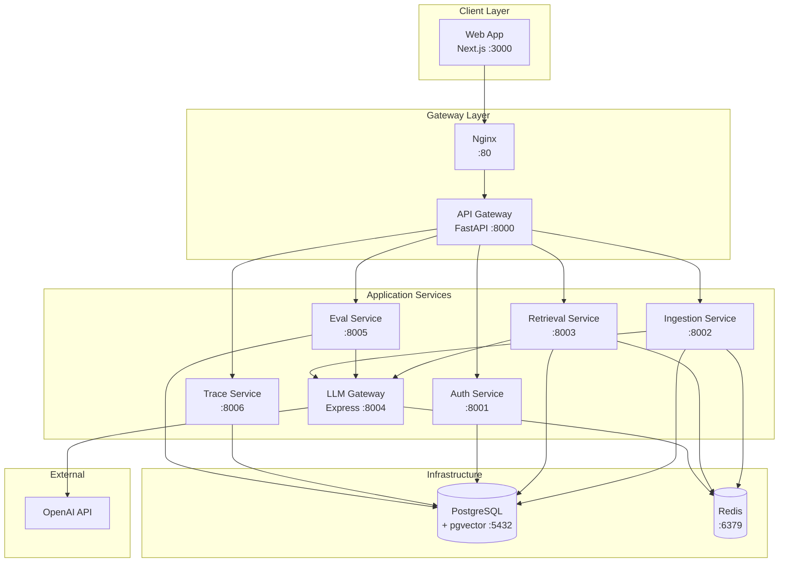
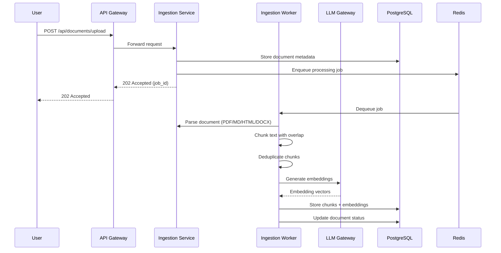
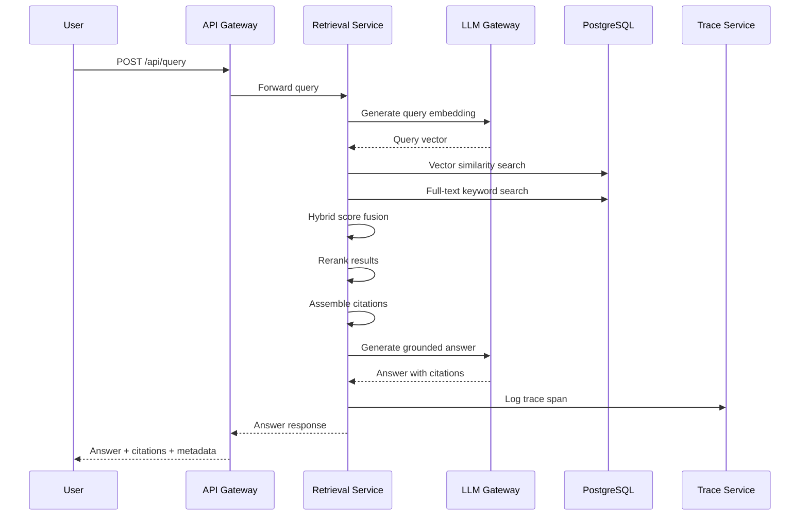

# Architecture

## System Overview

KnowledgeOps is a microservices platform composed of 8 application services and 3 infrastructure services, communicating through an API Gateway pattern.

## Service Topology



## Inter-Service Communication

### Synchronous (HTTP/REST)

| From | To | Purpose |
|------|----|---------|
| Web App | API Gateway | All client requests |
| API Gateway | Auth Service | Token validation, user lookup |
| API Gateway | Ingestion Service | Document upload, status check |
| API Gateway | Retrieval Service | Query execution |
| API Gateway | Eval Service | Eval run management |
| API Gateway | Trace Service | Trace queries |
| Retrieval Service | LLM Gateway | Answer generation |
| Ingestion Service | LLM Gateway | Embedding generation |
| Eval Service | LLM Gateway | Judge LLM calls |

### Asynchronous (Redis Queue)

| Publisher | Consumer | Purpose |
|-----------|----------|---------|
| Ingestion Service | Ingestion Worker | Document processing pipeline |
| Trace Service | — | Span ingestion batching |

## Data Flow

### Document Ingestion Flow



### Query & Retrieval Flow



## Database Schema

### Core Tables

```sql
-- Documents and chunks
documents (id, title, source, content_hash, version, status, created_at, updated_at)
chunks (id, document_id, content, chunk_index, embedding, metadata, created_at)

-- Users and auth
users (id, email, name, role, created_at)
api_keys (id, user_id, key_hash, name, last_used_at, created_at)

-- Evaluation
eval_runs (id, name, status, config, started_at, completed_at)
eval_results (id, run_id, query, expected, actual, scores, created_at)

-- Traces
traces (id, trace_id, service, operation, duration_ms, metadata, created_at)
trace_spans (id, trace_id, span_id, parent_span_id, operation, start_time, end_time, attributes)
```

## Design Decisions

### Monorepo with Docker Compose

A monorepo was chosen over polyrepo because all services share database schemas, Pydantic models, and deployment configuration. Docker Compose provides the simplest local development experience while remaining compatible with production orchestrators.

### API Gateway Pattern

The gateway centralizes authentication, routing, and health aggregation. This keeps individual services focused on their domain logic while providing a single entry point for the frontend.

### LLM Gateway as Separate Service

Isolating LLM calls behind a gateway enables provider swapping, response caching, budget enforcement, and cost tracking without modifying downstream services.

### PostgreSQL + pgvector

Using pgvector for embeddings avoids operational complexity of a separate vector database while providing sufficient performance for internal tooling workloads.
