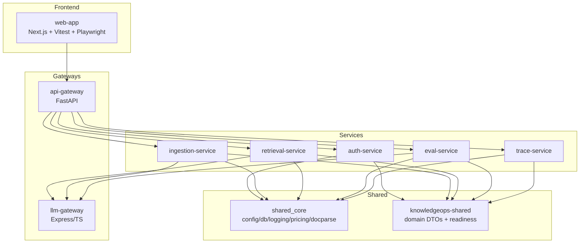
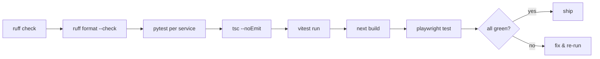

# Execution Plan

This document describes how KnowledgeOps is built, verified, and run — the concrete
sequence of commands and gates that take the platform from a clean checkout to a green,
demoable state. It complements [architecture.md](./architecture.md) (what the system is)
and [roadmap.md](./roadmap.md) (where it is going).

## Component map



## Build & install

A single root virtualenv installs `shared_core`, `knowledgeops-shared`, and the
pinned service dependencies:

```bash
# from the repo root
python -m venv .venv
.venv/Scripts/python -m pip install -e "../shared-core[dev,docparse]" numpy
.venv/Scripts/python -m pip install -e shared/python
.venv/Scripts/python -m pip install -r requirements.txt
```

The frontend installs separately:

```bash
cd services/web-app && npm install
```

## Verification gate



### Python (run from each service directory)

```bash
.venv/Scripts/python -m ruff check services shared/python
.venv/Scripts/python -m ruff format --check services shared/python
for svc in api-gateway auth-service ingestion-service retrieval-service eval-service trace-service; do
  (cd services/$svc && ../../.venv/Scripts/python -m pytest -q)
done
```

Each service's tests run from its own directory so the six `app` packages resolve without
colliding (a documented layout exception — see [AGENTS.md](../AGENTS.md)). Every service's
tests run with **no live PostgreSQL or Redis**: the in-memory fallbacks and dependency
overrides make the suite hermetic.

### Frontend (from `services/web-app`)

```bash
npx tsc --noEmit          # type-check
npx vitest run            # unit + component tests (jsdom)
npx next build            # production build
npx playwright test       # smoke spec (builds + starts next, no backend)
```

## Test strategy

| Layer | Where | What it covers |
|-------|-------|----------------|
| Pure functions | `test_auth_utils`, `test_judges`, `test_search`, `test_processing` | hashing, JWT, RBAC, cosine/lexical similarity, chunking, dedup |
| Routers / API | `test_routes`, `test_proxy`, `test_api`, `test_worker`, `test_trace_flow` | success + error paths via ASGI transport with mocked upstreams |
| Degraded mode | `test_worker`, `test_queue`, `test_readiness` | DB-down and Redis-down fallbacks, `/ready` backoff |
| Golden gates | `test_convergence` (ingestion), cosine pins (retrieval/eval) | numeric/string outputs pinned before any `shared_core` swap |
| Frontend | `src/**/__tests__`, `src/lib/__tests__` | demo-mode fallback, loading/empty/error states, ErrorBoundary |
| E2E smoke | `e2e/smoke.spec.ts` | every route renders with no backend + demo banner |

## Running the platform

```bash
make docker-up    # PostgreSQL (pgvector) + Redis + 8 services + nginx
make demo         # offline shared_core pipeline (ingestion→retrieval→cost→eval)
make worker       # ingestion arq worker
```

With no backend at all, the web console still runs (`npm run dev` in `services/web-app`)
and renders every screen from the demo dataset behind the "Demo mode" banner.

## Operational endpoints

| Endpoint | Purpose |
|----------|---------|
| `GET /health` | liveness; reports `healthy`/`degraded` per service |
| `GET /ready` | readiness; re-probes the DB with backoff, reports `mode` |
| `GET /api/health` | gateway-aggregated health across all services |
| `GET /api/costs` | cost summary (fixed: no longer shadowed by `/traces/{id}`) |
