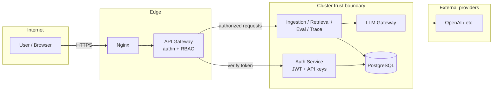
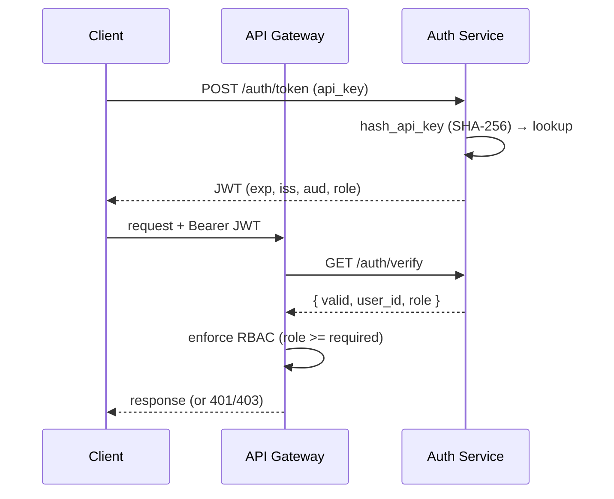
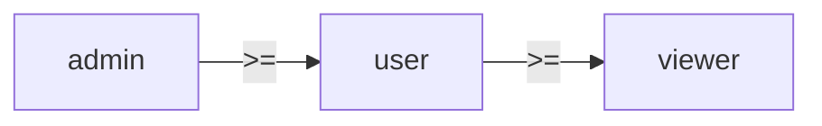

# Security Guide

## Trust boundaries

The API gateway is the single externally-reachable application entry point; every
backend service sits inside the cluster trust boundary and is reached only via the
gateway. The LLM gateway is the only component that talks to external providers.



## Authentication & authorization

API keys are exchanged for short-lived JWTs; the gateway validates every request
before forwarding it. Auth failures (401/403) are never masked by the frontend
demo fallback.



- **API keys** are stored only as SHA-256 hashes (`auth.hash_api_key`); the raw key is
  shown exactly once at creation.
- **JWTs** are signed HS256 and validated for signature, `exp`, `iat`, `iss`, and `aud`
  (`auth.verify_token`). A wrong secret, audience, issuer, or an expired token is rejected.
- **RBAC** is hierarchical (`check_permission`):



  `admin` (3) ≥ `user` (2) ≥ `viewer` (1). Admin-only routes (`/admin/*`, key creation,
  user listing) require the `admin` role at the gateway and the auth service.

## Threat model (STRIDE summary)

| Threat | Surface | Mitigation |
|--------|---------|------------|
| Spoofing | Forged tokens | HS256 signature + `iss`/`aud`/`exp` validation |
| Tampering | API key theft | Keys stored hashed; never logged |
| Repudiation | Untraced actions | Cost/operation spans recorded per request |
| Information disclosure | Excerpt leakage | Citations truncated; refusal when below threshold |
| Denial of service | Unbounded uploads | `max_file_size_mb`, request timeouts on every proxy call |
| Elevation of privilege | Role bypass | RBAC enforced at gateway **and** service |

## Secrets Management

### Microservices Secrets

Each service loads secrets from environment:

```bash
# Auth Service
JWT_SECRET_KEY=your-secret-key
JWT_ALGORITHM=HS256

# Database
DATABASE_PASSWORD=secure-password

# LLM Gateway (in services/llm-gateway/.env)
OPENAI_API_KEY=sk-...
```

### Docker Secrets (Production)

```yaml
# docker-compose.prod.yml
secrets:
  db_password:
    file: ./secrets/db_password.txt
  jwt_secret:
    file: ./secrets/jwt_secret.txt
```

### RBAC

Default roles:
- `admin`: Full access
- `user`: Standard access
- `viewer`: Read-only

## Security Checklist

- [ ] Secrets mounted as files, not env vars
- [ ] Database not exposed to internet
- [ ] JWT secrets rotated monthly
- [ ] Network policies between services
