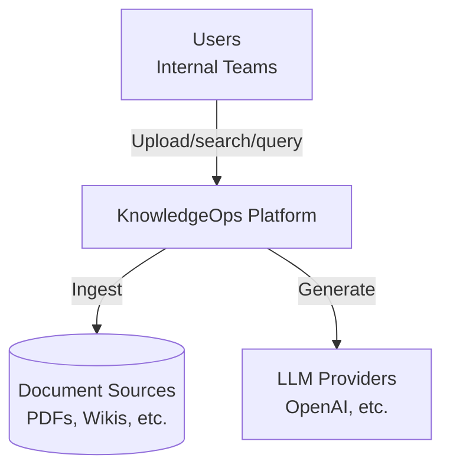
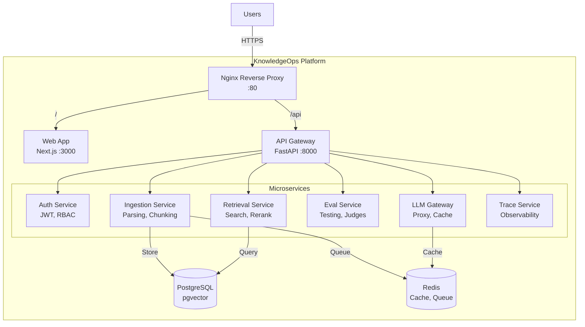
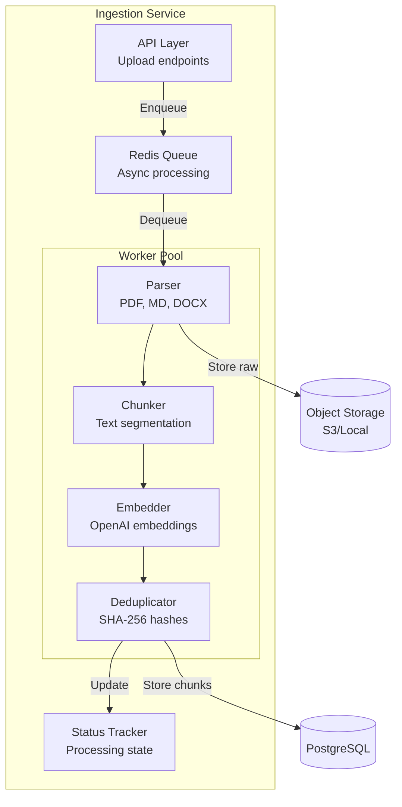
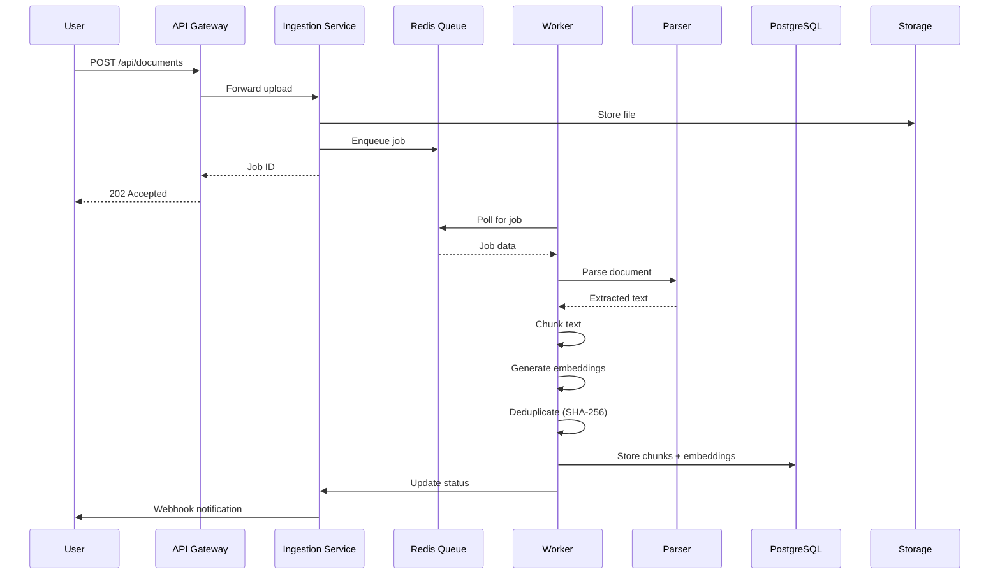

# KnowledgeOps Architecture (C4 Model)

## Context Diagram (C4 Level 1)

## Container Diagram (C4 Level 2)

## Component Diagram (C4 Level 3) - Ingestion Pipeline

## Data Flow - Document Ingestion

## Service Communication Patterns

| Pattern | Services | Technology |
|---------|----------|------------|
| Synchronous REST | API Gateway ↔ All services | HTTP/JSON |
| Async Queue | Ingestion → Workers | Redis Queue |
| Pub/Sub | Status updates | Redis Pub/Sub |
| Shared DB | All services | PostgreSQL |
| Shared Cache | LLM Gateway, Retrieval | Redis |

## Technology Stack

| Layer | Technology |
|-------|------------|
| Frontend | Next.js 14, React, TypeScript |
| API Gateway | FastAPI, Pydantic |
| Services | FastAPI (Python), Express (Node) |
| Database | PostgreSQL 16, pgvector |
| Cache/Queue | Redis 7 |
| Proxy | Nginx |
| Deployment | Docker Compose |

## Scalability Strategy

| Component | Scaling Approach |
|-----------|------------------|
| Web App | Static export + CDN |
| API Gateway | Horizontal (stateless) |
| Ingestion Workers | Horizontal (queue-based) |
| Retrieval | Read replicas |
| PostgreSQL | Primary + replicas |
| Redis | Cluster mode |

## Service Responsibilities

| Service | Responsibility | Key Endpoints |
|---------|----------------|---------------|
| Auth | Authentication, RBAC | /auth/* |
| Ingestion | Document processing | /ingestion/upload |
| Retrieval | Search, rerank | /retrieval/query |
| Eval | Automated testing | /eval/run |
| LLM Gateway | Provider routing | /llm/* |
| Trace | Observability | /traces/* |
