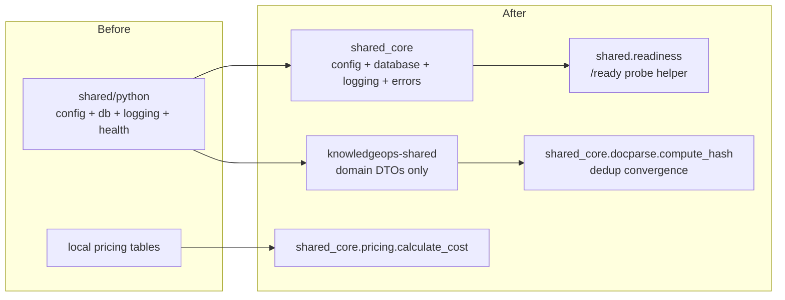

# Design Decisions

Pre-existing architectural decisions live under [adr/](./adr/). This file records the
decisions made when KnowledgeOps was migrated onto the `shared_core` standard and the
follow-up hardening (tests, readiness, demo mode, content-hash convergence).

## Decision: replace `shared/python` infra with `shared_core`

- **Context:** `shared/python` was a field-for-field reimplementation of the workspace's
  `shared_core` library (config, logging, async DB, health) that predated the editable
  install, plus genuine cross-service domain models.
- **Choice:** delete the infra modules (`config.py`, `db.py`, `logging.py`, `health.py`);
  each service subclasses `shared_core.config.BaseAppConfig` and uses
  `shared_core.database.AsyncDatabaseManager` / `shared_core.logging` / `shared_core.errors`.
  Keep `shared/python` as `knowledgeops-shared`, holding **only** the domain DTOs.
- **Tradeoff:** a one-time field-case migration (`database_url` → `DATABASE_URL`, etc.) and
  the loss of the bespoke `HealthResponse` aggregator shape, in exchange for one source of
  truth for infrastructure across the whole workspace.

## Decision: consolidate cost pricing on `shared_core.pricing`

- The three divergent pricing tables (`shared.config.MODEL_PRICING`, plus the per-1K and
  per-1M tables elsewhere) converge on `shared_core.pricing`; `estimate_cost` →
  `calculate_cost`. The default model rates are unchanged, so stored cost numbers are stable.

## Decision: keep `app/` per service (layout exception)

- **Context:** the template prescribes `src/<package>/`. KnowledgeOps has six FastAPI
  services that already use `app/` uniformly.
- **Choice:** keep `app/` per service and run each service's tests from its own directory
  so the six `app` packages don't collide. Documented in [AGENTS.md](../AGENTS.md).
- **Tradeoff:** a documented deviation from the flat template layout, avoiding a large,
  risky mechanical rename across ~90 files.

## Decision: adopt the content-hash convergence (golden-gated), defer the rest

- **Context:** ingestion deduplication computed SHA-256 hashes locally, duplicating
  `shared_core.docparse.compute_hash`.
- **Choice:** delegate `ingestion-service`'s `compute_hash` to `shared_core.docparse`,
  gated by `tests/test_convergence.py`, which pins the digest of several inputs and asserts
  byte-for-byte equality with both `shared_core` and a hard-coded golden value. The swap is
  provably identical, so persisted content hashes are unchanged.
- **Tradeoff:** none for hashing (identical output). The remaining convergence items
  (parsers, judges, cosine similarity, cost records) are **deliberately deferred** — each
  would change a numeric or structural output (numpy vs pure-python last-bit differences;
  differing metadata / `JudgeResult` / `CostRecord` shapes), so they require their own
  golden-output gating. Tracked in [roadmap.md](./roadmap.md).

## Decision: add `/ready` readiness probes with DB backoff

- **Context:** services already degrade to in-memory mode when PostgreSQL is down, but
  there was no dedicated readiness signal for orchestrators or the gateway aggregator.
- **Choice:** add a shared `shared.readiness` helper (`probe_database`, `readiness_payload`)
  with bounded exponential backoff, and a `/ready` endpoint on every Python service. The
  service always reports `ready: true` (it can serve in degraded mode); the `database`
  field communicates whether the persistent store is reachable.
- **Tradeoff:** a small additive surface (one helper module + one route per service) with
  no behavior change to existing endpoints.

## Decision: visible demo-mode fallback in the web console

- **Context:** the Next.js console showed only error states when the API gateway was down.
- **Choice:** `fetchApi` falls back to a static demo dataset on network errors and non-OK
  statuses (excluding 401/403, which must surface), flips a global demo-mode flag, and
  renders a sticky "Demo mode" banner. A Playwright smoke spec asserts every route renders
  with no backend running.
- **Tradeoff:** a maintained demo dataset that must track the DTO shapes — kept small and
  type-checked against the shared TS types so drift is caught by `tsc`.

## Decision: fix the shadowed `/traces/costs` route

- **Context:** in `trace-service`, the dynamic `/traces/{trace_id}` route was declared
  before the static `/traces/costs` route, so `GET /traces/costs` resolved to
  `get_trace("costs")` and the cost dashboard never received a cost summary.
- **Choice:** declare `/traces/costs` before `/traces/{trace_id}` (FastAPI matches in
  declaration order) and add a regression test
  (`test_costs_route_not_shadowed_by_trace_id`).
- **Tradeoff:** none — a pure correctness fix with no output change for the trace-by-id path.
