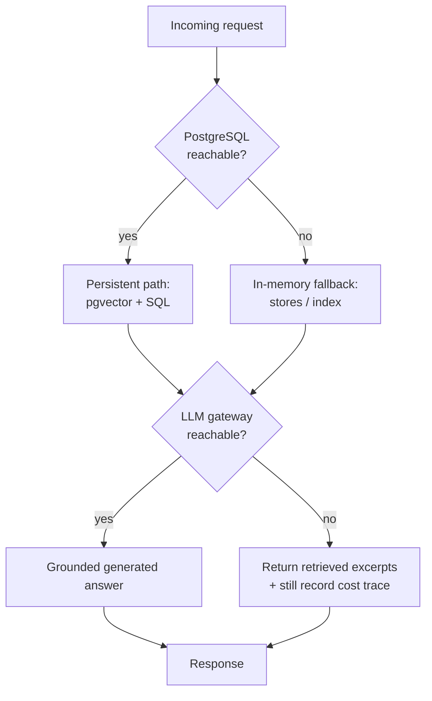
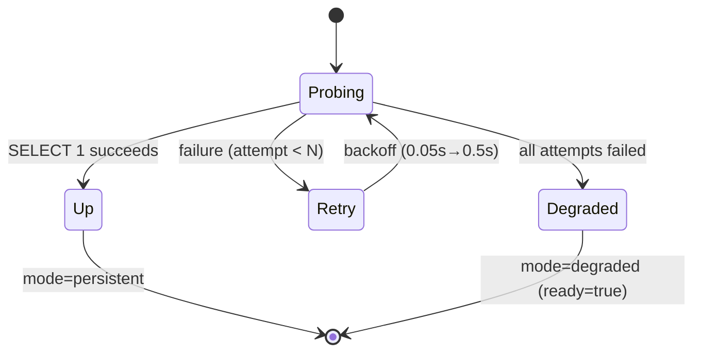

# Failure Modes

KnowledgeOps is designed to **degrade, not collapse**. Every dependency (database,
queue, LLM gateway) has an explicit fallback so a single outage downgrades a
capability rather than taking the platform down. This document enumerates each
failure mode, how it is detected, and how the system responds.

## Degradation overview

The web console mirrors this philosophy: when the API gateway is unreachable it
serves a **static demo dataset** behind a visible "Demo mode" banner (see
[`services/web-app/src/lib/demoData.ts`](../services/web-app/src/lib/demoData.ts)),
so the UI is never a blank error page.

## Database unavailable
- **Cause:** PostgreSQL down or unreachable at startup or at runtime.
- **Detection:** each service's lifespan probe (`init_db` / `check_db`) runs `SELECT 1`
  and sets a module-level `db_available = False` after a failure. The `/ready`
  readiness endpoint re-probes on demand with bounded exponential backoff
  (`shared.readiness.probe_database`).
- **Mitigation:** services degrade gracefully to in-memory stores/indexes; `/health`
  reports `"degraded"` and `/ready` reports `database: "down"`, `mode: "degraded"`
  while staying `ready: true` (the service can still serve requests). Unit tests
  exercise this degraded path with no DB required.
- **Memory bound (demo-scale):** the in-memory fallbacks are sized for demo/degraded
  operation, not as a durable store. The trace collector's `_traces_store` is a
  bounded FIFO (cap `_MAX_TRACES = 1000` distinct traces; oldest evicted) so long
  degraded operation cannot grow memory without limit. The remaining fallback stores
  (ingestion `_documents`/`_chunks`/`_jobs`, eval `_eval_runs`, retrieval
  `InMemoryIndex`) are demo-scale and bounded only by process lifetime — they are
  cleared on restart and are not intended to hold production-volume data while the DB
  is down.
- **Readiness probe state machine:**

- **Future fix:** automatic background reconnection so a recovered DB is picked up
  without a restart.

## Redis / ingestion queue unavailable
- **Cause:** Redis down; arq pool cannot connect.
- **Detection:** `get_redis_pool()` catches the connection error.
- **Mitigation:** ingestion falls back to in-process `asyncio` tasks (fire-and-forget).
- **Future fix:** durable queue with retry/dead-letter; the fallback loses jobs on restart.

## LLM gateway unavailable
- **Cause:** the TypeScript llm-gateway or upstream provider is down.
- **Detection:** `httpx` errors in `retrieval-service` answer generation.
- **Mitigation:** the service returns the relevant retrieved excerpts instead of a generated
  answer, and still records a cost trace.
- **Future fix:** provider fallback chains (already a gateway capability) surfaced upstream.

## Pricing drift
- **Cause:** model rates change upstream.
- **Detection:** unknown models log a one-time warning in `shared_core.pricing`.
- **Mitigation:** `shared_core.pricing.load_pricing_override(...)` merges a JSON/YAML rate
  file without code changes.

## Cross-service contract drift
- **Cause:** a shared domain DTO (`shared/python/shared/models.py`) changes shape.
- **Mitigation:** DTOs are centralized in `knowledgeops-shared`; update once, all services
  follow. Versioned `/api/v1` boundaries isolate external consumers.

## Frontend: API gateway unreachable
- **Cause:** the API gateway (or the `/api` proxy) is down or not yet wired.
- **Detection:** `fetchApi` (`services/web-app/src/lib/api.ts`) catches network errors
  and non-OK statuses (5xx, or a 404 when the `/api` proxy is unwired). Auth failures
  (401/403) are **never** masked — they surface to the user.
- **Mitigation:** the console transparently falls back to a static demo dataset and flips
  a global demo-mode flag, which renders a visible "Demo mode — backend unavailable"
  banner (`DemoBanner`). Every primary route stays interactive; a Playwright smoke spec
  (`e2e/smoke.spec.ts`) asserts this end-to-end with no backend running.
- **Future fix:** a lightweight reconnection poll that clears demo mode automatically once
  the gateway returns.

## Failure-mode summary

| Dependency | Detection | Fallback | Data loss? |
|------------|-----------|----------|------------|
| PostgreSQL | `SELECT 1` probe + `/ready` backoff | In-memory stores/index (trace store FIFO-capped; rest demo-scale) | No (within process lifetime) |
| Redis queue | `get_redis_pool()` catch | In-process `asyncio` task | Yes, on restart (documented) |
| LLM gateway | `httpx` error | Return retrieved excerpts | No |
| API gateway (UI) | `fetchApi` catch | Static demo dataset + banner | N/A (read-only demo) |
| Pricing table | unknown-model warning | `load_pricing_override(...)` | No |
