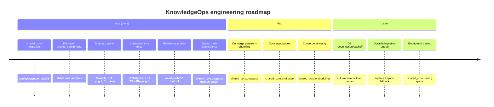

# Roadmap

The product roadmap lives in [../ROADMAP.md](../ROADMAP.md). This file tracks the
engineering follow-ups created by the migration onto `shared_core`.

## Now (done)
- ✅ Replace `shared/python` infrastructure with `shared_core` (config/logging/errors/DB).
- ✅ Consolidate cost pricing on `shared_core.pricing`.
- ✅ Standard spine (Makefile, ruff, pyright, CI installing shared-core, demo).
- ✅ **Comprehensive test suite** — ~150 Python unit/integration tests across the six
  services, 19 Vitest component/unit tests, and a 7-case Playwright smoke spec.
- ✅ **Readiness probes** — every Python service exposes `/ready`, which re-checks the
  database with bounded exponential backoff via `shared.readiness`.
- ✅ **Content-hash convergence** — `ingestion-service` deduplication delegates to
  `shared_core.docparse.compute_hash`, golden-gated by `tests/test_convergence.py` so the
  digest is provably byte-identical to the previous local implementation.
- ✅ **Web console demo mode** — the Next.js app falls back to a static dataset behind a
  visible banner when the backend is unreachable.

## Next — domain-capability convergence
Each service still carries a local copy of a capability that now exists in `shared_core`.
These are **deliberately deferred**: each would change a numeric or structural output and
the parity is not yet bit-exact (see [design-decisions.md](./design-decisions.md)). They
must be converged with golden-output tests so results don't drift:
- `ingestion-service` parsers + chunking → `shared_core.docparse` (metadata shape differs).
- `eval-service` judges → `shared_core.evaljudge` (`JudgeResult` shape differs from the
  runner's float-score contract).
- `retrieval-service` / `eval-service` cosine similarity → `shared_core.embeddings`
  (numpy vs pure-python differ by ~1e-16; could flip the 4th decimal in rare cases).
- `trace-service` cost records → `shared_core.tracing.CostRecord` (field names differ:
  `estimated_cost`/`total_tokens` vs the cost-dashboard's `total_cost_usd`).

## Later
- DB reconnection/backoff so a recovered database is picked up without a restart.
- Durable ingestion queue (replace the asyncio fallback).
- Cross-service tracing via `shared_core.tracing` spans end-to-end.

## Intentionally not building (now)
- A rename of each service's `app/` package to `src/<package>/` — kept as a documented
  layout exception to avoid a high-risk mechanical change across ~90 files.
